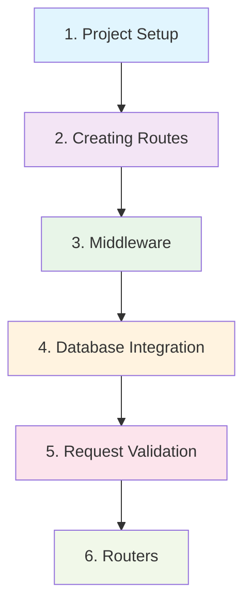

# Artanis Tutorial: Building a Blog API

Welcome to the comprehensive Artanis tutorial! In this step-by-step guide, we'll build a complete Blog API from scratch, covering all the essential concepts you need to master Artanis.

## What You'll Learn

By the end of this tutorial, you'll understand:

- ✅ **Project Setup** - Creating and organizing an Artanis project
- ✅ **Route Creation** - Defining endpoints and handling different HTTP methods
- ✅ **Middleware** - Adding logging, authentication, and error handling
- ✅ **Database Integration** - Connecting to and managing data
- ✅ **Request Validation** - Validating and sanitizing input data
- ✅ **Code Organization** - Using routers for modular applications

## What We'll Build

Our Blog API will include:

- **📝 Post Management**: Create, read, update, and delete blog posts
- **👤 User Authentication**: Register users and manage sessions
- **🔒 Authorization**: Protect endpoints based on user permissions
- **✅ Data Validation**: Ensure data integrity with validation middleware
- **📊 Request Logging**: Track API usage and performance
- **🛡️ Error Handling**: Graceful error responses with proper HTTP status codes

## Prerequisites

Before starting, make sure you have:

- **Python 3.8+** installed
- **Basic Python knowledge** (async/await, classes, functions)
- **HTTP/REST API concepts** (GET, POST, PUT, DELETE)
- **Artanis installed**: `pip install artanis uvicorn[standard]`

!!! tip "New to Python async/await?"
    If you're new to asynchronous Python, don't worry! The tutorial explains async concepts as we go. You can also check out the [Python async/await documentation](https://docs.python.org/3/library/asyncio.html).

## Tutorial Structure

The tutorial is divided into 6 progressive chapters:

-   :material-numeric-1-circle:{ .lg .middle } **[Project Setup](01-project-setup.md)**

    ---

    Set up your development environment and create the basic project structure

    **Topics**: Virtual environments, project structure, basic app setup

-   :material-numeric-2-circle:{ .lg .middle } **[Creating Routes](02-creating-routes.md)**

    ---

    Learn how to define routes and handle different HTTP methods

    **Topics**: Route registration, path parameters, request/response handling

-   :material-numeric-3-circle:{ .lg .middle } **[Middleware](03-middleware.md)**

    ---

    Add powerful middleware for logging, CORS, and error handling

    **Topics**: Global middleware, path-based middleware, custom middleware

-   :material-numeric-4-circle:{ .lg .middle } **[Database Integration](04-database-integration.md)**

    ---

    Connect to a database and implement data persistence

    **Topics**: Database setup, models, CRUD operations

-   :material-numeric-5-circle:{ .lg .middle } **[Request Validation](05-request-validation.md)**

    ---

    Validate and sanitize incoming request data

    **Topics**: Input validation, error responses, data sanitization

-   :material-numeric-6-circle:{ .lg .middle } **[Routers](06-routers.md)**

    ---

    Organize your code with modular routers and subrouting

    **Topics**: Router classes, subrouting, code organization

## Tutorial Flow

Each chapter builds on the previous one:

## Code Examples

All code examples are:

- ✅ **Complete and tested** - Every snippet has been verified to work
- ✅ **Progressive** - Each example builds on the previous ones
- ✅ **Explained** - Clear explanations of what each part does
- ✅ **Production-ready** - Following best practices and security guidelines

## Getting Help

If you get stuck at any point:

1. **Check the code**: Each chapter includes complete, working code examples
2. **Review the API docs**: Detailed documentation for every class and method
3. **Ask for help**: Open an issue on [GitHub](https://github.com/nordxai/Artanis/issues)
4. **Join discussions**: Participate in [GitHub Discussions](https://github.com/nordxai/Artanis/discussions)

## Alternative Learning Paths

Depending on your experience level:

=== "Beginner"
    📚 **Follow the tutorial step-by-step**

    - Start with [Project Setup](01-project-setup.md)
    - Don't skip any chapters
    - Run all code examples
    - Read all explanations

=== "Intermediate"
    🚀 **Focus on advanced topics**

    - Skim through [Project Setup](01-project-setup.md) and [Creating Routes](02-creating-routes.md)
    - Study [Middleware](03-middleware.md) and [Database Integration](04-database-integration.md)
    - Focus on [Request Validation](05-request-validation.md) and [Routers](06-routers.md)

=== "Advanced"
    ⚡ **Jump to specific topics**

    - Use the tutorial as a reference
    - Focus on [Routers](06-routers.md) for code organization
    - Check out [examples](../examples/index.md) for advanced patterns
    - Dive into [API documentation](../api/core/app.md)

Let's get started! 🚀

[Start Tutorial: Project Setup →](01-project-setup.md){ .md-button .md-button--primary }
